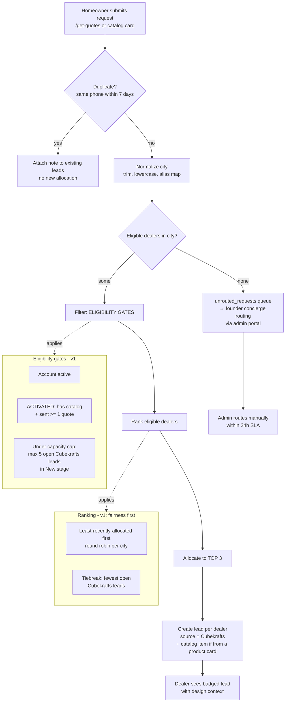
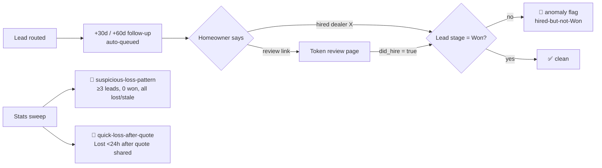

# Cubekrafts — Lead Allocation Schematic

**Prepared by:** COO · **Status:** v1 implemented in product · v2/v3 = post-raise roadmap
**Principle:** every allocation decision serves one of three masters — **homeowner speed**, **dealer fairness**, or **platform revenue quality**. When they conflict: homeowner first, fairness second, revenue third (trust compounds; short-term revenue doesn't).

---

## 1. The allocation flow (v1 — live)



### Why these v1 choices

| Decision | Rationale |
|---|---|
| **3 dealers per lead** | Homeowner gets real comparison (our promise); dealer competition stays honest but not brutal; 3 shots at a Won deal = 3 shots at the 1% fee. |
| **Activated dealers only** | An un-activated dealer silently swallows a lead → homeowner hears from no one → platform promise broken at the moment of first trust. |
| **Round-robin, not performance-first** | With <20 dealers, performance data is noise. Fairness builds supply-side trust ("everyone gets leads"), which is what converts pilots to paying. |
| **Capacity cap (5 open New leads)** | A dealer sitting on 5 untouched leads is a black hole; routing more there wastes homeowner intent. Cap forces distribution and nudges stale dealers to work their inbox. |
| **7-day phone dedup** | The same homeowner resubmitting must not create 3 fresh leads per submission — dealers judge lead quality fast, and duplicates read as "junk leads." |
| **Unrouted → admin queue, 24h SLA** | No-coverage cities are a *sales signal* (demand map for expansion), not an error. Founder routes manually or calls the homeowner. |

---

## 2. v2 — performance-weighted allocation (post first 10 paying dealers)

When there's enough signal (≥20 leads/dealer), replace round-robin with a **weighted score**, keeping an exploration slice:

```
score(dealer) = 0.40 × response_speed      (median time New → Quoted, normalized)
             + 0.30 × win_rate             (Won / leads received, shrunk toward mean for small n)
             + 0.20 × fairness_debt        (time since last allocation)
             + 0.10 × homeowner_rating     (post-project rating, once ratings exist)

Allocation: 2 slots by score, 1 slot exploration (random among eligible newer dealers)
```

- **Response speed is weighted highest** — in Indian home-improvement lead-gen, the first dealer to call typically wins; speed is also the best proxy for a dealer who values the platform.
- **Shrinkage on win_rate** prevents a lucky 2-for-2 dealer from starving everyone.
- **The exploration slot** is how new dealers earn data — otherwise cold-start dealers never get ranked.
- **Fairness debt** guarantees no eligible dealer starves entirely (retention insurance).

## 3. v3 — monetization-aware allocation (post-raise)

- **Priority tiers:** dealers who've paid fees get a modest score boost (never exclusivity — the homeowner must always get 3 genuine options).
- **Category matching:** wardrobe requests route to wardrobe-capable dealers (dealer capability flags).
- **Radius matching:** lat/long + service radius instead of city string.
- **Accept/decline with SLA:** dealer must accept within 2h or the slot reallocates to #4 — converts allocation from push to pull and generates response-time data.
- **Anti-gaming:** Won-value audits (spot-check against shared quote totals), penalty for chronic "Lost" marking with off-platform wins (detected via homeowner follow-up SMS).

## 4. Metrics that police the allocator

1. **Time-to-first-quote** per lead (homeowner promise) — target < 24h.
2. **Allocation Gini coefficient** (fairness) — if one dealer takes >40% of a city's leads, inspect.
3. **Lead → Quoted rate per dealer** (black-hole detection) — feeds the capacity gate.
4. **Unrouted rate by city** (expansion map).
5. **Dedup hit rate** (lead-quality guard).

---

*v1 is deliberately boring: fairness + activation gates + caps. Boring is what you can defend to a dealer on a phone call — "everyone in your city gets an equal shot, and nobody gets buried." The clever stuff earns its complexity only once real volume exists.*

---

## 5. Leakage defense — enforcing the 1% won-deal fee (v1 shipped)

The won-fee runs on self-reporting; a dealer can mark "Lost" and close offline. Defense-in-depth, cheapest layer first:



**Layer 1 — homeowner as source of truth:** 30/60-day follow-up queue in admin (WhatsApp deep-link, outcome recorded). The homeowner has no reason to lie; a "hired" answer against a non-Won lead auto-flags.
**Layer 2 — make Won valuable:** dealer Reputation card (kitchens delivered · avg rating · review count) + wins feed v2 allocation priority. Hiding a win costs future leads + public reputation — worth more than 1%.
**Layer 3 — money-flow capture (post-raise):** escrow/payment-protection, EMI, hardware procurement. Deals become visible by construction. This is the terminal fix; requires payments partner + capital.
**Layer 4 — detection nets:** anomaly flags panel in admin (hired-but-not-Won, did_hire-review mismatch, suspicious-loss-pattern, quick-loss-after-quote). Consequence is commercial, not legal: flagged gaming → suspension from allocation (stated in pilot agreement).

## 6. Lead-credit monetization — SUPERSEDED by `08-revenue-model-v2.md` (approved & shipped Jul 2026)

Scarcity preserved (configurable cap, default 3) — you cannot sell exclusivity if you broadcast. Free during pilots; switch on when a cohort is activated:

| Tier | Price (proposed) | What it buys |
|---|---|---|
| Starter (free) | ₹0 | 5 shared leads/month — the hook stays free |
| Shared lead | ₹99–199/lead | Standard allocation (up to cap dealers) |
| Exclusive lead | ₹399–599/lead | Allocated to 1 dealer only |
| Won-deal fee | 1% of deal | Kept as aligned upside, policed by §5 |

Revenue floor = lead credits (upfront, enforceable). Upside = won-fee + (post-raise) procurement margin/financing take. Validate price points with the first 10 pilots before hard-coding.
